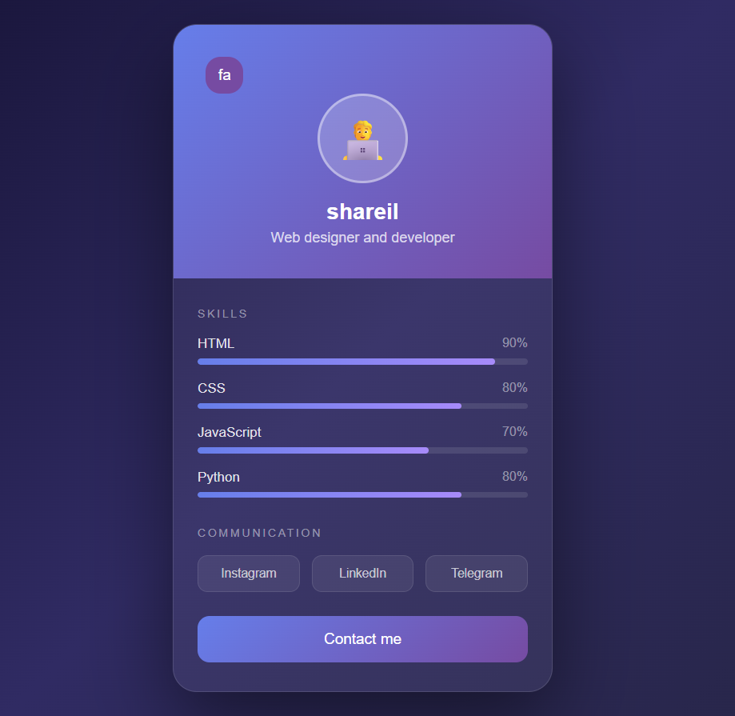
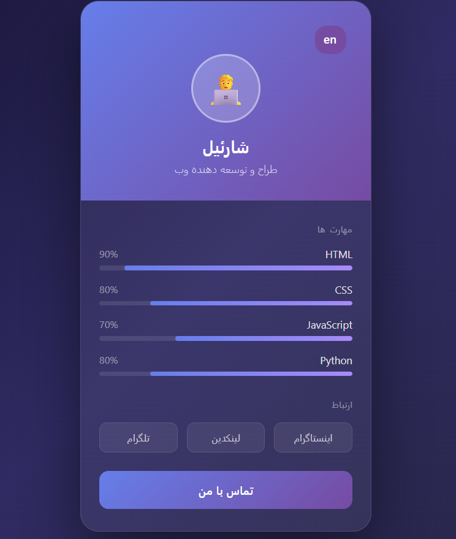

# 💳 Digital Business Card

A clean, modern digital business card built with pure HTML, CSS, and JavaScript — available in both **English** and **Persian (Farsi)**, with a language switch button.


## ✨ Features

- 🌐 Full support for English (LTR) and Persian (RTL)
- 🔄 Quick language switch button
- 📊 Animated skill progress bars
- 🔗 Social media links (Instagram, LinkedIn, Telegram)
- 📱 Responsive design
- 🎨 Modern glassmorphism style with gradients

## 🖼️ Screenshots

<p align="center">
  
  
</p>

## 🔗 Live Demo

Check out the live version here:
👉 [View Online](https://shareilzare.github.io/my-business-card/)

## 📁 Project Structure

```
├── index.html          # English version
├── persian.html         # Persian version
├── style.css            # Styles
├── script.js            # Skill bar animation
└── screenshots/
    ├── english.png       # English version screenshot
    └── persian.png       # Persian version screenshot
```

## 🚀 Usage

1. Clone the repository:
   ```bash
   git clone https://github.com/shareilzare/my-business-card.git
   ```
2. Open `index.html` (English) or `persian.html` (Persian) in your browser.
3. Edit your personal info, skills, and social media links in the HTML files.

## 🛠️ Built With

- HTML5
- CSS3 (Flexbox, Gradients, Transitions)
- JavaScript (Vanilla)
- [Vazirmatn](https://fonts.google.com/specimen/Vazirmatn) font

## 📄 License

This project is licensed under the MIT License.

---

Made with ❤️ by shareil
